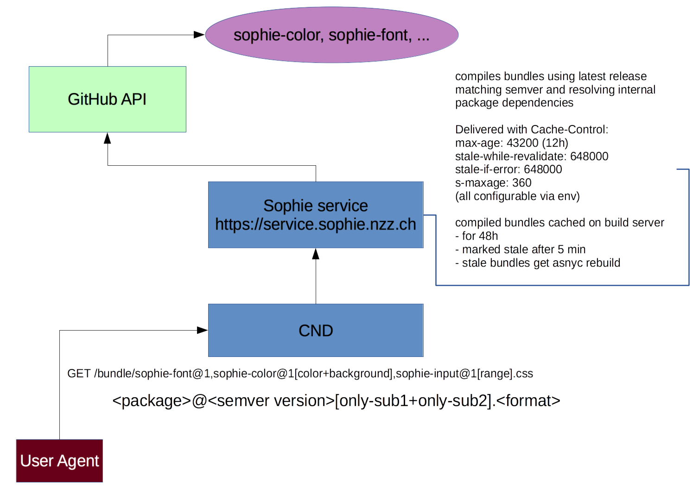

# Sophie Service

**Maintainer**: [manuelroth](https://github.com/manuelroth)

Served for the public through: https://service.sophie.nzz.ch



# Deployment

This is running on our internal Rancher hosts and publicly served through keycdn.
You need to define GITHUB_USER_NAME and GITHUB_AUTH_TOKEN as env variables to make this work.
You also need to set APP_ENV to 'staging' or 'production'.

## Logging

Set these ENV variables to enable logging: `PINO_SOCKET_ADDRESS`, `PINO_SOCKET_MODE` and `PINO_SOCKET_PORT`

# Development

## develop sophie modules

Sophie modules follow this versioning scheme: `public-bc.internal-bc.feature` for example `1.2.0` where

- `public-bc`: bumped if there is a bc breaking change in the public styles (css or json) of the package (e.g. things removed, drastic changes)
- `internal-bc`: bumped if there is a change in the internal structure that could make depending sophie modules break
- `feature`: bumped in all other cases e.g. a thing is added without changing existing structure

This enables usage like this:

- bundles are requested with the first number pinned e.g. sophie-color@1
- internal dependencies (see below) are pinned to the second number eg. sophie-color@1.1

Try to not bump `public-bc` for as long as possible (this should be years) as everything using this version should eventually be updated or the version should be maintained and adapted to context redesigns (e.g. nzz.ch gets a redesign) to make old stuff match the new style.

### sophie bundle config

Add a property `sophie` to your package.json that looks like this to depend on other packages. You can then import things from these packages.
See tests for examples.

```
"sophie": {
  "dependencies": {
    "sophie-nzzas-font": "1.1.x",
    "sophie-nzzas-color": "1.0.x"
  }
}
```
